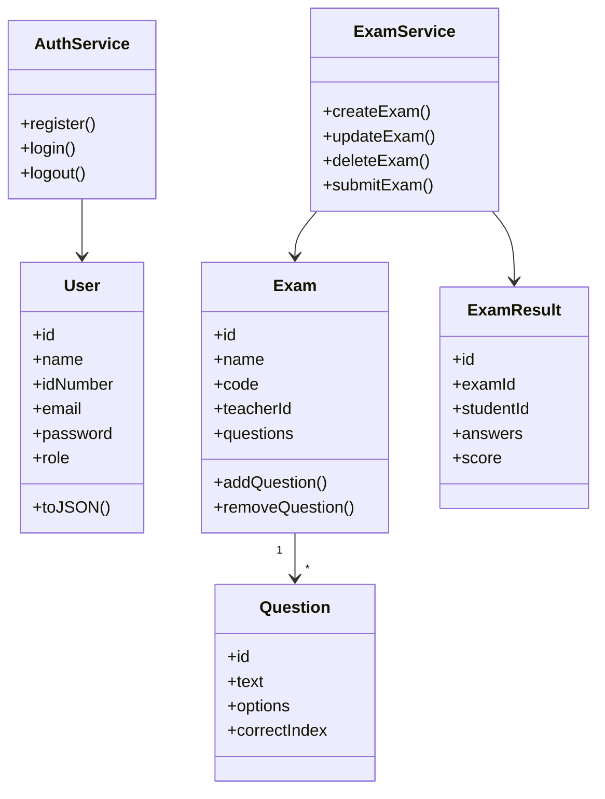

# פרויקט המשך – מערכת מבחנים צד לקוח (Client Side)

מערכת מבחנים מלאה הפועלת **בדפדפן בלבד** – פרויקט לקורס **סדנת תכנות בסביבת האינטרנט**, מכללת תל-חי.

## קישורים
- **GitHub:** https://github.com/Mohammad-Safadi/exam-system-client
- **Deploy (GitHub Pages):** https://mohammad-safadi.github.io/exam-system-client/

## טכנולוגיות
- ES Modules
- OOP Classes
- JSON
- localStorage

## תפקידי משתמשים

### מורה
- יצירה, עריכה ומחיקה של מבחנים
- הוספת שאלות אמריקאיות
- צפייה ברשימת מבחנים שיצר
- צפייה בתוצאות תלמידים

### סטודנט
- צפייה במבחנים זמינים
- חיפוש מבחן לפי שם או קוד
- ביצוע מבחן ושליחה
- צפייה בציון מיידי, היסטוריה וממוצע

## דפים במערכת

| דף | קובץ |
|----|------|
| דף ראשי (שם + ת.ז + GitHub) | `index.html` |
| הרשמה | `register.html` |
| התחברות | `login.html` |
| התנתקות | `logout.html` |
| דף ראשי למורה | `teacher/index.html` |
| יצירת מבחן | `teacher/create-exam.html` |
| פרטי מבחן | `teacher/exam.html` |
| דף ראשי לסטודנט | `student/index.html` |
| חיפוש מבחן | `student/search.html` |
| ביצוע מבחן | `student/take-exam.html` |

## מבנה קבצים

```
exam-system-client/
├── index.html, login.html, register.html, logout.html
├── css/styles.css
├── js/
│   ├── models/       # User, Exam, Question, ExamResult
│   ├── services/     # AuthService, ExamService, StorageService
│   ├── pages/        # לוגיקה לכל דף
│   ├── components/   # nav.js
│   └── utils/        # helpers.js
├── teacher/
└── student/
```

## שירותים (Services)

| שירות | תפקיד |
|-------|--------|
| `StorageService` | CRUD גנרי על localStorage |
| `AuthService` | הרשמה, התחברות, session |
| `ExamService` | ניהול מבחנים ותוצאות |

## הרצה מקומית
פתח עם **Live Server** ב-VS Code על `index.html`.

## משתמשי דמו
- מורה: `teacher@demo.com` / `1234`
- סטודנט: `student@demo.com` / `1234`

## תוספות (מעבר לדרישות הבסיסיות)
- ⏱️ טיימר למבחן
- ✅ הצגת תשובות נכונות לאחר הגשה

## OOP Diagram



## מפתח
- **שם:** אילייא רינאוי
- **ת.ז:** עדכן ב-`js/pages/home.js`

מסמך טכני מלא: `TECHNICAL.md`
