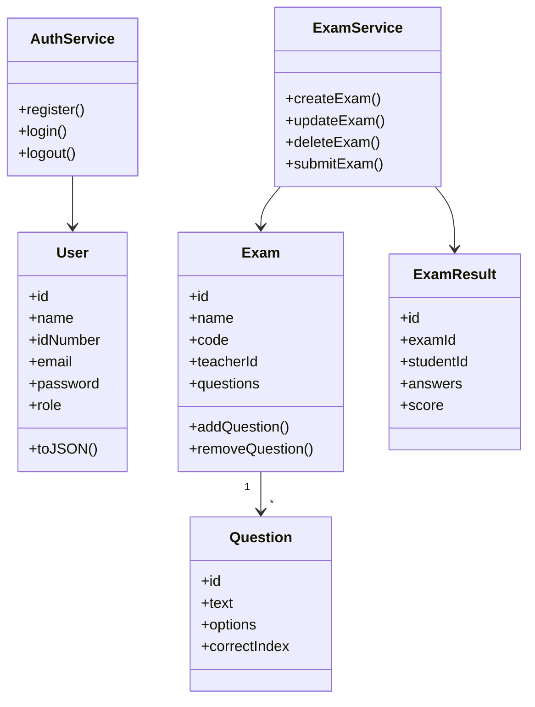

# Exam System - Client Side Project

Browser-only exam management system built for **סדנת תכנות בסביבת האינטרנט** (Tel-Hai).

## Features

### Teacher
- Create, edit, and delete exams
- Add multiple-choice questions
- View student results per exam
- Manage exams with unique access codes

### Student
- Search exams by name or code
- Take exams and submit answers
- View score immediately after submission
- See exam history and average score

## Tech Stack
- HTML5 + CSS3
- JavaScript ES Modules
- OOP Classes
- JSON data format
- localStorage persistence

## Project Structure

```
exam-system-client/
├── index.html              # Landing page
├── login.html              # Login
├── register.html           # Registration
├── css/styles.css
├── js/
│   ├── models/             # User, Exam, Question, ExamResult
│   ├── services/           # Auth, Exam, Storage services
│   ├── pages/              # Page controllers
│   ├── components/nav.js
│   └── utils/helpers.js
├── teacher/
│   ├── index.html          # Teacher dashboard
│   ├── create-exam.html
│   └── exam.html           # Exam details + questions + results
└── student/
    ├── index.html          # Student dashboard
    ├── search.html
    └── take-exam.html
```

## Run Locally

Use Live Server (VS Code) or any static server:

```bash
npx serve .
```

Then open `http://localhost:3000`.

## Demo Accounts

- Teacher: `teacher@demo.com` / `1234`
- Student: `student@demo.com` / `1234`

## GitHub Pages

1. Push repository to GitHub
2. Settings → Pages → Deploy from `main` branch
3. Use deployed URL in submission

## OOP Diagram (Main Classes)



## Author

- **Name:** אילייא רינאוי
- **ID:** Update in `js/pages/home.js`
- **GitHub:** https://github.com/Mohammad-Safadi/exam-system-client
- **Live Demo:** https://mohammad-safadi.github.io/exam-system-client/

See `TECHNICAL.md` for JSON formats and navigation flow.
