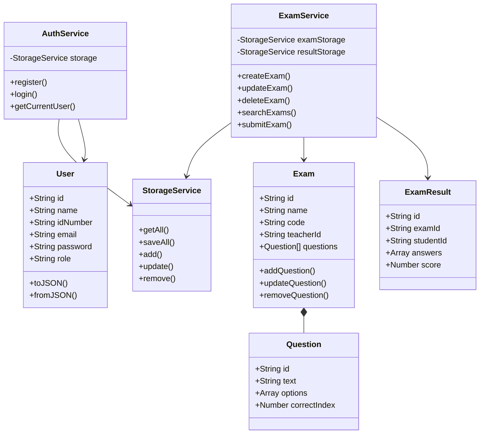
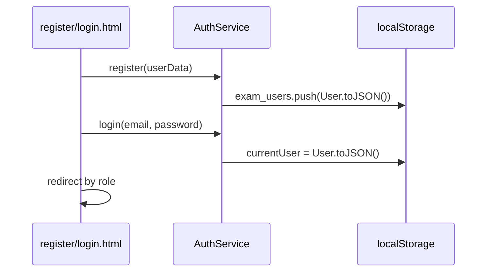
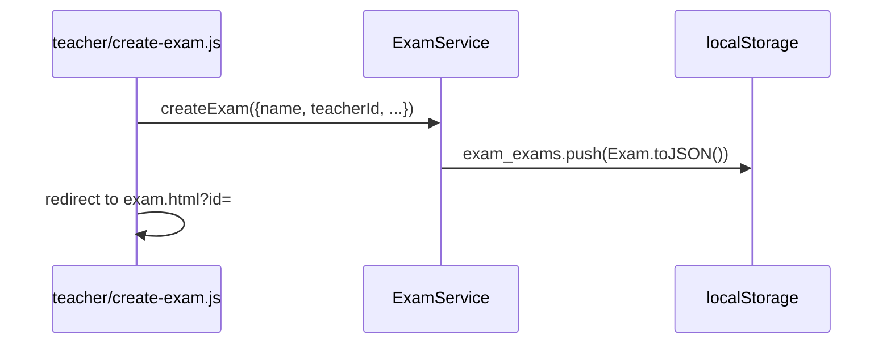
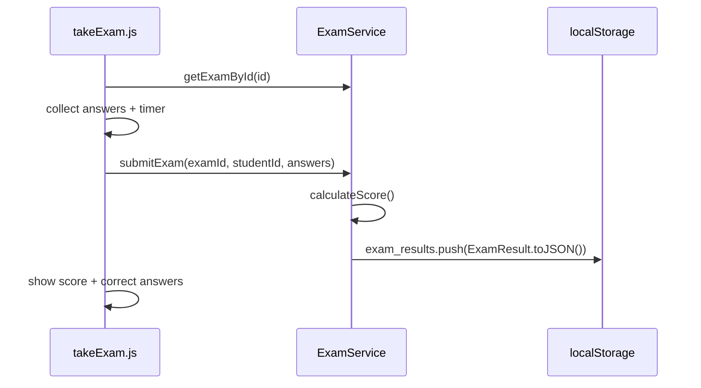

# מסמך טכני – מערכת מבחנים

## GitHub + Deploy
| | כתובת |
|---|--------|
| קוד מקור | https://github.com/Mohammad-Safadi/exam-system-client |
| אתר חי | https://mohammad-safadi.github.io/exam-system-client/ |

## דפים וניווט

```
index.html ──► login.html / register.html
                    │
         ┌──────────┴──────────┐
         ▼                     ▼
 teacher/index.html    student/index.html
         │                     │
         ├── create-exam.html  ├── search.html
         └── exam.html         └── take-exam.html

logout.html ──► index.html (מכל דף דרך navbar)
```

| דף | נתיב | גישה |
|----|------|------|
| דף ראשי | `/index.html` | ציבורי |
| הרשמה | `/register.html` | ציבורי |
| התחברות | `/login.html` | ציבורי |
| התנתקות | `/logout.html` | מחוברים |
| אזור מורה | `/teacher/index.html` | מורה |
| יצירת מבחן | `/teacher/create-exam.html` | מורה |
| פרטי מבחן | `/teacher/exam.html?id=...` | מורה (בעלים בלבד) |
| אזור סטודנט | `/student/index.html` | סטודנט |
| חיפוש | `/student/search.html` | סטודנט |
| ביצוע מבחן | `/student/take-exam.html?id=...` | סטודנט |

## פורמט JSON ב-localStorage

### משתמשים – `exam_users`
```json
[{
  "id": "user_...",
  "name": "Demo Teacher",
  "idNumber": "123456789",
  "email": "teacher@demo.com",
  "password": "1234",
  "role": "teacher",
  "createdAt": "2026-07-11T12:00:00.000Z"
}]
```

### מבחנים – `exam_exams`
```json
[{
  "id": "exam_...",
  "name": "JavaScript Basics",
  "description": "מבחן דemo",
  "category": "Web",
  "code": "A1B2C3",
  "durationMinutes": 30,
  "teacherId": "user_...",
  "questions": [{
    "id": "question_...",
    "text": "מה זה JSON?",
    "options": ["פורמט", "שפה", "DB", "Framework"],
    "correctIndex": 0
  }],
  "createdAt": "...",
  "updatedAt": "..."
}]
```

### תוצאות – `exam_results`
```json
[{
  "id": "result_...",
  "examId": "exam_...",
  "studentId": "user_...",
  "answers": [0, 2, 1],
  "score": 67,
  "submittedAt": "..."
}]
```

### Session – `currentUser`
אובייקט User של המשתמש המחובר.

## UML – מחלקות עיקריות



## Flows מרכזיים

### Flow 1 – הרשמה והתחברות


### Flow 2 – מורה יוצר מבחן


### Flow 3 – סטודנט מבצע מבחן


## אחריות מחלקות

| מחלקה | אחריות |
|--------|---------|
| `User` | ישות משתמש (מורה/סטודנט) |
| `Question` | שאלה אמריקאית עם אפשרויות |
| `Exam` | מבחן + אוסף שאלות |
| `ExamResult` | ניסיון הגשה של סטודנט |
| `StorageService` | עטיפה ל-localStorage |
| `AuthService` | אימות והרשאות |
| `ExamService` | לוגיקת מבחנים וציונים |
